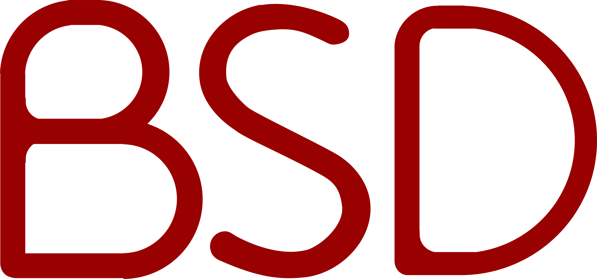

<!-- class: invert -->

 
*and derivatives

---

# History - Unix

- The earliest distributions of Unix from Bell Labs in the 1970s included the source code to the operating system, allowing researchers at universities to modify and extend Unix.
- BSD began life as a variant of Unix that programmers at the University of California at Berkeley, initially led by Bill Joy, began developing in the late 1970s. It included extra features, which were intertwined with code owned by AT&T. 

---

# History - USL v. BSDi

- The lawsuit slowed development of the free-software descendants of BSD for nearly two years while their legal status was in question, and as a result systems based on the Linux kernel, which did not have such legal ambiguity, gained greater support.
- The final release from Berkeley was 1995's 4.4BSD-Lite Release 2, after which the CSRG was dissolved and development of BSD at Berkeley ceased.

---

# Variants

- FreeBSD
- OpenBSD
- NetBSD
- DragonFly BSD

---

# Differences from Linux

- Stability
  - A core team of developers controls the entire system, including the kernel and the userland
- Licensing
  - The BSD license allows proprietary use, and the code is used in several proprietary operating systems, such as Apple's macOS and Microsoft's Windows.

---

# FreeBSD

- Web, DNS, Mail, and File Servers
- Firewalls, Routers
- NAS (TrueNAS)
- Embedded Systems
- Desktop

---

# FreeBSD in use

- Darwin (VFS, Networking, Userspace)
- Nintendo DS/Switch (Networking)
- Windows (Networking)
- PlayStation 3-5
- VMWare ESXi

---

# OpenBSD

- Security
  - Proactive security features
  - Security audits
  - Security by default
- Networking
  - PF firewall
  - CARP
  - OpenBGPD
  - OpenSSH

---

# Thank you!
