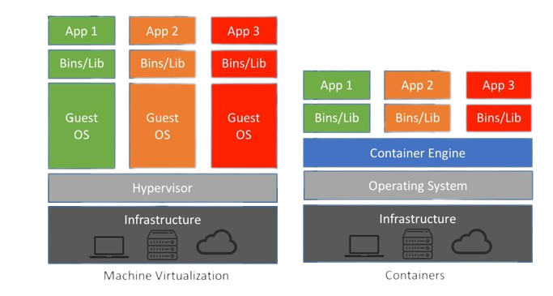
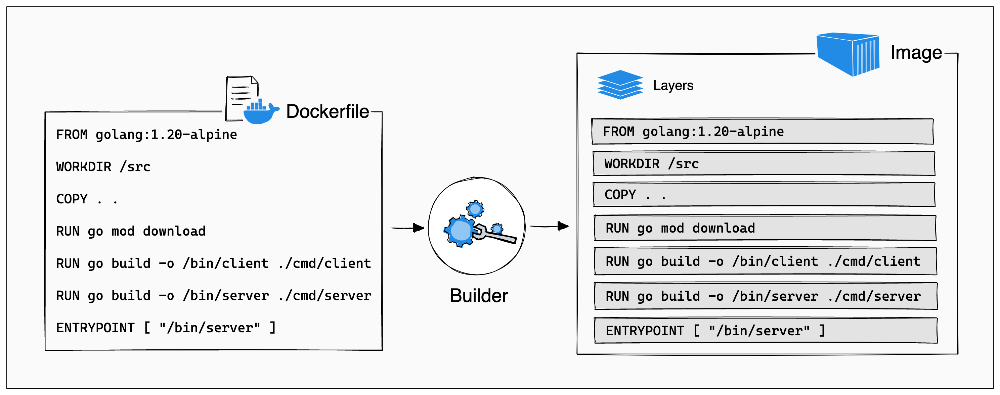
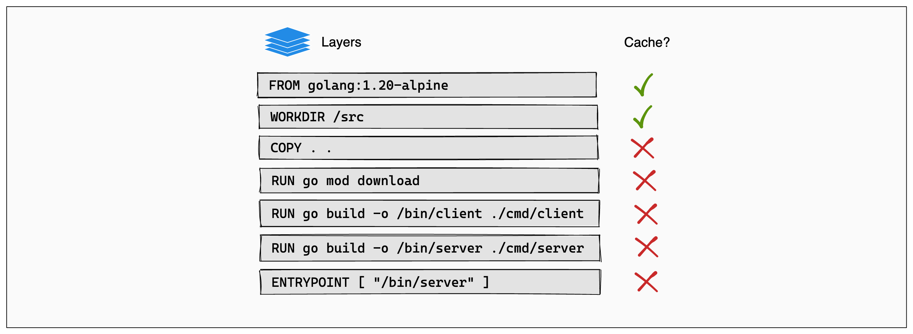

<!-- class: invert -->

# <!-- min-width -->  Docker

Container platform

---
# What is Docker?
> Docker is a set of platform as a service (PaaS) products that use OS-level virtualization to deliver software in packages called **containers**.
- Docker is a tool that allows you to build, deploy, and manage **containers**.

---
# What is a Container?
> A container is a standard unit of software that packages up code and all its dependencies so the application runs quickly and reliably from one computing environment to another.

- lightweight, portable, and isolated.

---
# How does it work?

> Docker makes use of kernel **_namespaces_** to provide the isolated workspace called the container. When you run a container, Docker creates a set of **_namespaces_** for that container. These **_namespaces_** provide a layer of isolation. Each aspect of a container runs in a separate namespace and its access is limited to that namespace.
---
# Namespaces
Docker Engine uses the following namespaces on Linux:

- `PID` - process isolation.
- `NET` - managing network interfaces.
- `IPC` - managing access to IPC resources.
- `MNT` - managing filesystem mount points.
- `UTS` - isolating kernel and version identifiers and hostnames.
- `USER` - user and group identity.
- `TIME` - virtualizing system clocks.
- `CGROUP` - managing cgroup hierarchies.

---
# What is a Container really?

## Containers are essentially isolated processes

---
# How is this different from a VM?
<!--  -->

---

# Virtual Machines
## Pros
- High level of isolation
- Support most operating systems
- Work better with specialized hardware
## Cons
- Require large amount of disk (>10GB)
- Performance penalty
- OS maintenance

---

# Containers
## Pros
- Easy to manage
- Resource efficient
- Very portable
- Fast startup times
## Cons
- Primarily linux only
- Lower level of isolation

---
# Demo Time
- [Docker Engine](https://docs.docker.com/get-docker/)

# [`tinyurl.com/uug-killer`](https://tinyurl.com/uug-killer)

---
# Layers

---
# Cached layers

---
# Resources

- [Killercoda demo](https://killercoda.com/jmunixusers/scenario/Docker)
- [Get Started with Docker](https://www.docker.com/get-started)
- [Get Docker](https://docs.docker.com/get-docker/)
- [Docker playground](https://labs.play-with-docker.com/)
- [Use the Docker command line](https://docs.docker.com/engine/reference/commandline/cli/)

---
