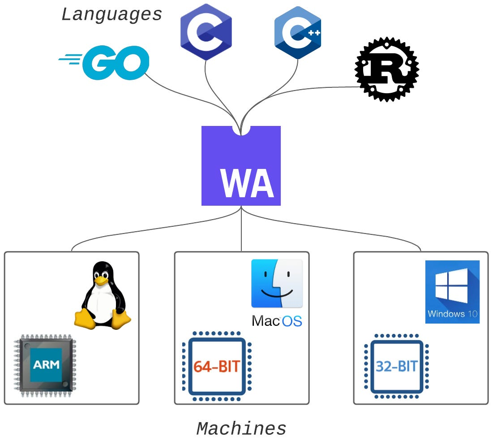

<!-- class: invert -->

# <!-- min-width -->  Software Isolation Techniques for Limiting Attack Surfaces

## Ray Steen

---

# Problem

---

# You all write shitty code
## *- Professor Bernstein*

---

---

# How can we mitigate this?

---

---

# Technique 1
## Virtual Machines

---

---

# Virtual Machines - Advantages

- ### Works out of the box
- ### Any OS
- ### Strong isolation

---

# Virtual Machines - Disadvantages

- ### Large resource usage
- ### Performance overhead
- ### OS maintenance

---

# Technique 2
## Containers

---

---

# Containers - Advantages

- ### Resource efficient
- ### Very portable
- ### Fast startup times
- ### No performance overhead

---

# Containers - Disadvantages

- ### Primarily linux only
- ### Not optimal from some applications
- ### Moderate isolation

---

# Technique 3
## WASM

---

---

# WASM - Advantages

- ### Very portable
- ### Fast startup times
- ### Runs in the browser
- ### Strong isolation

---

# WASM - Disadvantages

- ### Pre-built or source code required
- ### No official standard interface
- ### Performance overhead

---

---