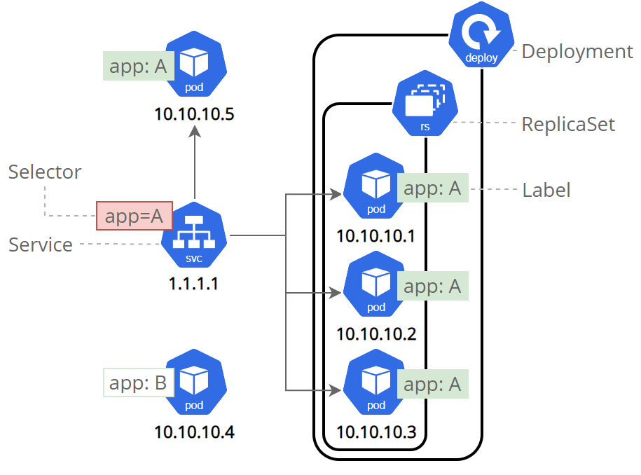

<!-- class: invert -->

# <!-- min-width -->  Kubernetes

Container orchestration

---

# Recap - Containers are...

- lightweight
- portable
- isolated

---

# Recap - Containers are...

### Abstractions for a collection of process isolation tecniques.
- Namespaces
- Cgroups

---
# Scenerio

---
# Problem

---
# Solution 1
## Scale Vertically

---

---

# Solution 2
## Scale Horizontally

---

---
# How do we do that?
## Docker

---

# What is Kubernetes (k8s)?

### Kubernetes is an open-source container orchestration platform designed to automate the deployment, scaling, and management of containerized applications.

---
# Key concepts - Nodes

- Physical or virtual machines running containerized applications.
- Each node has a container runtime (e.g., Docker) and services to communicate with the master and other nodes.
- Nodes collectively form the infrastructure where containerized applications run.

---
# Key concepts - Control Plane
- Manages the state of the Kubernetes cluster.
- Responsible for scheduling applications, scaling, and rolling out updates.
- Acts as the central coordinator for the entire Kubernetes cluster.

---
# Key concepts - Pods

- Basic deployable unit, representing a single instance of a running process.
- Pods contain one or more tightly coupled containers sharing resources and network.
- Fundamental for managing and scaling containerized applications.

---
# Key concepts - Services

- Abstraction defining a set of pods and a policy for accessing them.
- Enables loose coupling between different parts of an application.
- Provides stable endpoints for communication within the Kubernetes cluster.

---
# Key concepts - ReplicaSets

- Manages and ensures a specified number of pod replicas are running at all times.
- Supports scaling applications horizontally by adjusting the number of replicas.
- Ensures high availability and fault tolerance for containerized applications.

---
# Key concepts - Deployments

- Higher-level abstraction over ReplicaSets for declarative updates to applications.
- Describes how applications should be deployed and updated over time.
- Simplifies scaling, rolling updates, and rollbacks for containerized applications.

---
# Demo time

# [`tinyurl.com/uug-killer`](https://tinyurl.com/uug-killer)
---

# Resources

- [Killercoda demo](https://killercoda.com/jmunixusers/scenario/Docker)
- [Learn Kubernetes Basics](https://kubernetes.io/docs/tutorials/kubernetes-basics/)
- [Kubernetes Tutorials](https://kubernetes.io/docs/tutorials/)
- [minikube Getting Started](https://minikube.sigs.k8s.io/docs/start/)
- [Kubernetes Getting started](https://kubernetes.io/docs/setup/)

---

