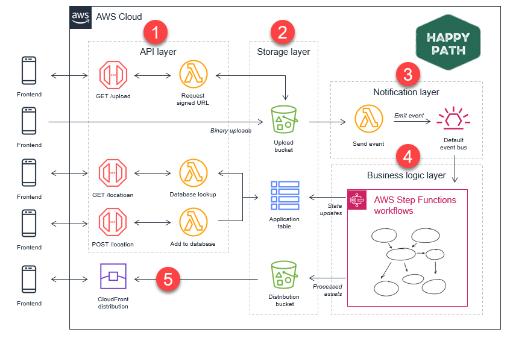

<style>section  { justify-content: start; }</style>
<style scoped>section  { justify-content: center; }</style>

<!-- class: invert -->
<style scoped>section  { justify-content: center; }</style>

# <!-- min-width -->  Web Development

Episode 1 - The phantom menace

---

# How does the web work?


---
<style scoped>section {
  display: flex;
  justify-content: center;
  align-items: center;
}
</style>

# Backend vs Frontend
---



---

# API

> An API, or application programming interface, is a set of rules or protocols that let software applications communicate with each other to exchange data, features and functionality.


---

# What is HTTP?

- HyperText Transfer Protocol
- A protocol for transferring data over the web

---

# Anatomy of an HTTP request
## Request
```http
GET / HTTP/1.1
Host: www.opera.com
```

---
# Anatomy of an HTTP request

## Response
```http
HTTP/1.1 200 OK
Date: Wed, 23 Nov 2011 19:41:37 GMT
Server: Apache
Content-Type: text/html; charset=utf-8
Set-Cookie: language=none; path=/; domain=www.opera.com; expires=Thu, 25-Aug-2011 19:41:38 GMT
Set-Cookie: language=en; path=/; domain=.opera.com; expires=Sat, 20-Nov-2021 19:41:38 GMT
Vary: Accept-Encoding
Transfer-Encoding: chunked

<!DOCTYPE html>
<html lang="en">
...
```

---

<style scoped>
section {
  display: flex;
  justify-content: center;
  align-items: center;
}
</style>

# Demo time

`pip install flask`

---

<style scoped>
section {
  display: flex;
  justify-content: center;
  align-items: center;
}
</style>

# Thank you!
